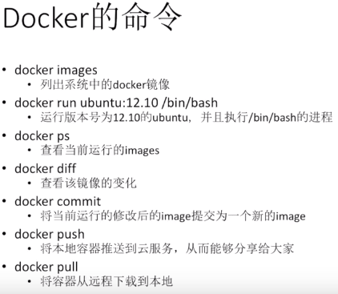

### Docker partner
- Amazon
- IBM
- Microsoft

### 挑战　
- 向服务器部署代码困难　
- 为什么？
- 复杂多变的技术栈
　- 前端技术：JS,HTML,BootStrap,React...
  - 后端技术：Python,Nginx,Node.js
  - 数据库技术：MongoDB,MySQL,Hadoop...
  - 数据分析技术：Spark,Hive...
  - 消息队列：Kafka,Redis
  - 操作系统：Linux
  - 硬件平台:PC,Mac,服务器...
不同的技术之间的版本冲突和依赖...
### 怎么破？

从生活中寻找答案
与代码部署最接近的是货运
- 通过各种方法（如汽车，火车，游轮，飞机）
- 运送各种货物（如石油，钢琴，啤酒，尿布）
如何通过多种方法运送货物？
集装箱（统一标准）
为什么不用虚拟机（过于沉重）
- 打包的东西太多了，动辄上Ｇ
- 运行的代价太大了，单机动辄十几个
Docker的优点
- 相当于传统的方法
　- 能够同时交付并部署程序所运行的环境
- 相当于虚拟机
　-仅仅是打包必需的内容。

