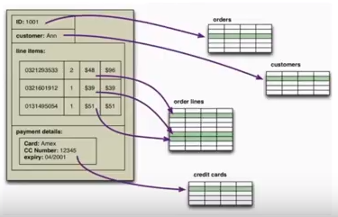
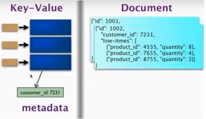

### Introduction to Nosql
Martin Fowler

> History

20世纪８０年代

#### 关系型数据库兴起　

- 持久性：日志和备份
- 一致性:事物
- 沟通语言：SQL的（structured Queried Language)
挑战
* 关系并非人性

逻辑视图！＝物理视图

#### 方案
- 面向对象的数据库
- 当时关系型数据库已经统治了整个世界
### 新挑战
数据越来越大～
- 更大更强的服务器
- 更多的小服务器（Google:BigTable;Amazon)
大公司已经走到了前面，想到了方法。
我们该怎么办呢？

### NoSQL
- 2009年的时候Twitter发消息的时候，随手创建的一个tag
### NoSQL是什么？
分类：
### 聚合型数据库
- Key-Value:redis,riak
  - 我有一个key，告诉我key的value是 什么.
- Document:mongoDB.CouchDB
  - 每个文档的东西一起
- Column-family:HBase,Cassandra
  - 行列构成key

### 图型数据库
- Neo4j
  - 点和边

好处:
以前在mysql中的结构下查询数据时，因为底层是分布在不同的表中，需要在不同的表中去找。nosql的特点是对于同一个类型的数据在该聚类下找就行。查询速度有所提高。
聚合型数据库是无结构的吗？
- 没有显示的结构。
- 依然逃脱不了隐式的结构。
聚合型数据库的挑战？
- 数据是按照一种方法聚集的　
- 当你希望用另一种方法聚集的时候，就会　有问题。
- 你会碰到Map-Reduce的需求

如何选择关系型数据库和聚合型数据库？
- 你主要查询一种聚集方法～

什么是一致性？
- 逻辑一致性:多个用户造成的问题。
（多个用户向同一个账号写入）
- 副本一致性:多个副本的问题。（有的更新，有的没更新,版本号）.
什么是CAP？
- 当Partition出现时
当你有很多机器都在保存相关的数据的时候，而且数据之间有各种副本。如果有些机器被分割时（即这些机器网络不通，有些机器能够被访问到有些不能访问）。
- 如何能够平衡Consistency和Availability.

为了能够更新一个数据,是等到所有机器都能访问到还是不要等。

当P出现时如何平衡C和A.

CAP原则是NOSQL数据库的基石。Consistency（一致性）。 Availability（可用性）。Partition tolerance（分区容错性）。

事务机制：数据库特有的术语，单个逻辑工作单元执行的一系列操作，同步发生数据更新时，防止数据的不一致。

传统的关系型数据库在功能支持上通常很宽泛，从简单的键值查询，到复杂的多表联合查询再到事务机制的支持。而与之不同的是，NoSQL系统通常注重性能和扩展性，而非事务机制（事务就是强一致性的体现）。

###　总结
- NoSQL的起源是把一个东西的数据聚集在　一起
- CAP是节点被分割后，如何平衡一致性和　延迟
- 很多用户和副本都会带来一致性问题哦 